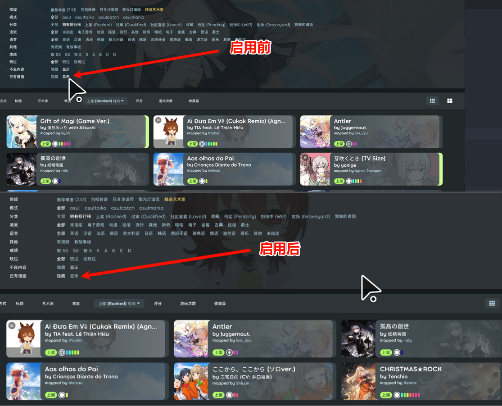

# LocalMapFilter

`LocalMapFilter` 是一个面向 `osu!lazer` 的单功能 ruleset。

## 功能



- 在谱面下载页增加 `已有谱面` 选项
- 可切换：
  - `隐藏`：过滤本地已有谱面
  - `显示`：显示全部谱面
- 切换后会刷新当前搜索结果
- 选项状态会持久化保存
- 支持中文 / 英文显示

## 安装

- 在 GitHub 右侧 `Releases` 下载最新发布文件
- 解压后，将生成的文件放到 `osu!lazer` 的 ruleset 目录
- 如果你是本地构建，也可以直接使用生成的 `dll`

## 本地构建

```powershell
dotnet build .\osu.Game.Rulesets.LocalMapFilter\osu.Game.Rulesets.LocalMapFilter.csproj -c Release
```

## 输出文件

- `osu.Game.Rulesets.LocalMapFilter\bin\Release\net8.0\osu.Game.Rulesets.LocalMapFilter.dll`
